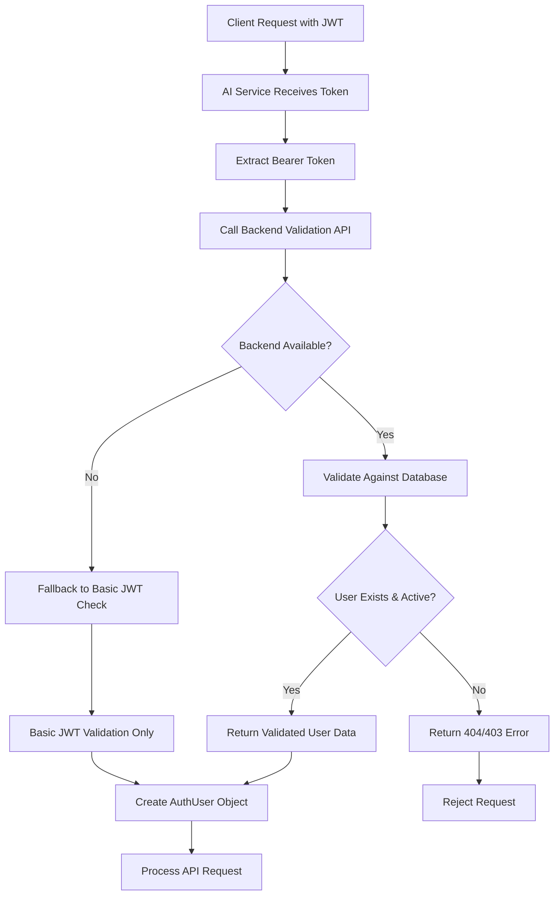

# Secure AI Service Authentication Implementation

## Security Problem Solved

**Issue**: The AI service was only validating JWT token signatures without verifying that the user actually exists in the MongoDB database. This created a security vulnerability where malicious actors could potentially forge valid tokens with fake user data.

## Solution: Token Validation Service

We implemented a secure two-layer authentication system:

### 1. Backend Token Validation Endpoint

**Location**: `server/routes/api/internal/auth.js`

```javascript
POST / api / internal / auth / validate - token;
```

**Features**:

- ✅ Validates JWT signature and expiration
- ✅ Checks user exists in MongoDB database
- ✅ Verifies user account is active and verified
- ✅ Validates session if sessionId is present
- ✅ Handles demo tokens correctly
- ✅ Protected by internal service headers

### 2. AI Service Enhanced Authentication

**Location**: `ai-service/middleware/auth.py`

**Features**:

- ✅ Calls backend validation service for every token
- ✅ Graceful fallback to basic JWT validation if backend unavailable
- ✅ Async implementation for better performance
- ✅ Comprehensive error handling and logging
- ✅ Maintains demo user limitations

## Authentication Flow



## Security Benefits

### ✅ **Database Verification**

- Every token is validated against the actual user database
- Prevents attacks using forged tokens with fake user data
- Ensures user accounts are still active and verified

### ✅ **Session Validation**

- Validates that the session ID in the token still exists
- Prevents use of tokens from logged-out sessions

### ✅ **Internal Service Protection**

- Backend validation endpoint only accepts requests from `deployio-ai-service`
- Uses `X-Internal-Service` header validation

### ✅ **Graceful Degradation**

- If backend is unavailable, falls back to basic JWT validation
- Logs fallback usage for monitoring
- Prevents service outages due to network issues

### ✅ **Demo Token Handling**

- Special handling for demo tokens (no database user)
- Maintains demo limitations and proper logging

## Error Handling

The system provides detailed error responses:

- **401 Unauthorized**: Invalid or expired token
- **403 Forbidden**: User account disabled or demo token on restricted endpoint
- **404 Not Found**: User doesn't exist in database
- **500 Internal Error**: Backend validation service unavailable

## Configuration

### Backend Environment Variables

```bash
# No additional config needed - uses existing JWT_SECRET
```

### AI Service Environment Variables

```bash
# Backend URL for token validation
BACKEND_URL=http://localhost:3000

# Shared JWT secret (must match backend)
JWT_SECRET=your_secret_here
```

## Monitoring & Logging

The system logs:

- ✅ Successful validations with database verification
- ⚠️ Fallback validations (when backend unavailable)
- ❌ Failed validations with specific error reasons
- 📊 Authentication events for rate limiting analysis

## Testing

### Test Valid User Token

```bash
# Get user token from login
curl -H "Authorization: Bearer <user_token>" \
     -H "X-Internal-Service: deployio-backend" \
     http://localhost:8001/api/v1/analysis/supported-technologies
```

### Test Demo Token

```bash
# Generate demo token
curl -X POST http://localhost:3000/api/dev/demo-token

# Use demo token
curl -H "Authorization: Bearer <demo_token>" \
     -H "X-Internal-Service: deployio-backend" \
     http://localhost:8001/api/v1/analysis/supported-technologies
```

### Test Fallback Mode

```bash
# Stop backend service and test fallback
# Should still work but log fallback warnings
```

## Security Best Practices Implemented

1. **🔐 Defense in Depth**: Multiple validation layers
2. **🛡️ Principle of Least Trust**: Always verify with authoritative source
3. **🔄 Graceful Degradation**: Service continues during backend issues
4. **📝 Audit Trail**: Comprehensive logging for security monitoring
5. **⚡ Performance**: Async validation doesn't block requests
6. **🎯 Minimal Exposure**: Internal validation endpoint not publicly accessible

## Future Enhancements

- **Token Caching**: Cache validation results for short periods to reduce backend calls
- **Rate Limiting**: Add per-user rate limiting in AI service itself
- **Metrics**: Add authentication success/failure metrics for monitoring
- **Distributed Validation**: Support multiple backend instances for HA

This implementation ensures that the AI service can securely validate user tokens against the actual database while maintaining high availability and performance.
