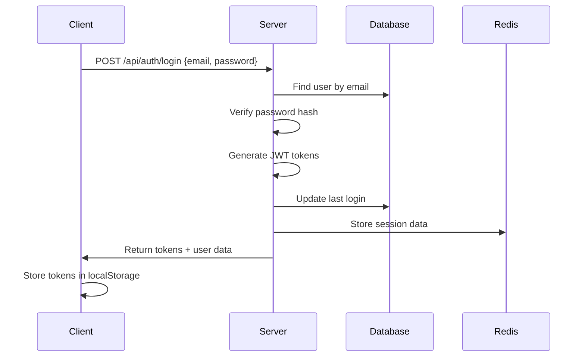
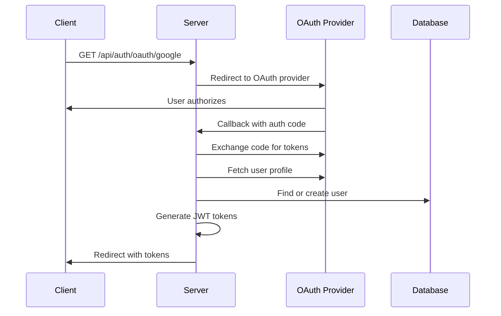
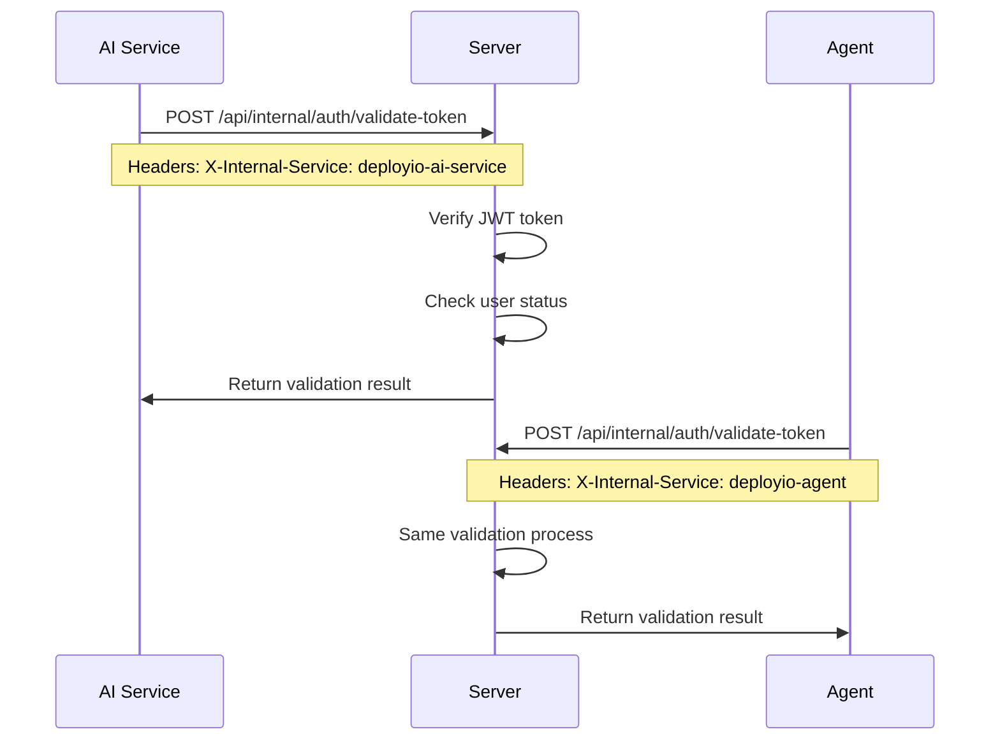

# DeployIO Authentication System - Comprehensive Documentation

## Table of Contents

1. [Architecture Overview](#architecture-overview)
2. [Core Components](#core-components)
3. [Authentication Flows](#authentication-flows)
4. [Security Features](#security-features)
5. [Service-to-Service Authentication](#service-to-service-authentication)
6. [Token Management](#token-management)
7. [OAuth Implementation](#oauth-implementation)
8. [Two-Factor Authentication](#two-factor-authentication)
9. [Session Management](#session-management)
10. [Rate Limiting & Security](#rate-limiting--security)
11. [WebSocket Authentication](#websocket-authentication)
12. [Security Enhancements & Recommendations](#security-enhancements--recommendations)
13. [Implementation Details](#implementation-details)
14. [Troubleshooting](#troubleshooting)

## Architecture Overview

DeployIO implements a comprehensive multi-layer authentication system across four main services:

```
┌─────────────────┐    ┌─────────────────┐    ┌─────────────────┐    ┌─────────────────┐
│   Client App    │    │  Server (API)   │    │  AI Service     │    │     Agent       │
│   (Vue.js)      │    │   (Express)     │    │   (FastAPI)     │    │   (FastAPI)     │
└─────────────────┘    └─────────────────┘    └─────────────────┘    └─────────────────┘
         │                       │                       │                       │
         │                       │                       │                       │
    OAuth Flow                JWT-based              Backend Token           Backend Token
    JWT Tokens             Authentication           Validation w/           Validation w/
    Local Storage              Sessions              Fallback               Fallback
         │                       │                       │                       │
         └───────────────────────┼───────────────────────┼───────────────────────┘
                                 │                       │
                            Central Auth DB          Token Validation API
                            (MongoDB)                (/api/internal/auth)
```

### Key Principles

- **Zero-Trust Architecture**: Every request is authenticated and validated
- **Service Isolation**: Each service has its own authentication layer
- **Token-Based Security**: JWT tokens for stateless authentication
- **Fallback Mechanisms**: Local validation when backend is unavailable
- **Comprehensive Logging**: Full audit trail of authentication events

## Core Components

### 1. Server Authentication (Express.js)

**Location**: `server/controllers/user/authController.js`, `server/services/user/authService.js`

**Primary Features**:

- User registration and login
- OAuth integration (Google, GitHub)
- JWT token generation and refresh
- Two-factor authentication (TOTP)
- Session management with device fingerprinting
- Password reset and email verification
- Rate limiting and security monitoring

**Key Endpoints**:

```javascript
POST /api/auth/register        // User registration
POST /api/auth/login          // User login
POST /api/auth/refresh        // Token refresh
POST /api/auth/logout         // User logout
GET  /api/auth/oauth/google   // Google OAuth
GET  /api/auth/oauth/github   // GitHub OAuth
POST /api/auth/2fa/setup      // 2FA setup
POST /api/auth/2fa/verify     // 2FA verification
```

### 2. AI Service Authentication (FastAPI)

**Location**: `ai-service/middleware/auth.py`

**Primary Features**:

- Backend token validation with fallback
- FastAPI dependency injection
- Comprehensive error handling
- Request logging and monitoring

**Authentication Flow**:

```python
@app.middleware("http")
async def auth_middleware(request: Request, call_next):
    # 1. Extract Bearer token
    # 2. Validate with backend API
    # 3. Fallback to local JWT validation
    # 4. Attach user context to request
```

### 3. Agent Authentication (FastAPI)

**Location**: `agent/app/middleware/auth.py`

**Primary Features**:

- Internal service validation
- Backend token validation with fallback
- Public endpoint bypass
- Wildcard subdomain support

**Security Model**:

```python
# Internal service header required
X-Internal-Service: deployio-backend

# Bearer token validation
Authorization: Bearer <jwt_token>

# Public endpoints (no auth)
/, /health, /docs, /redoc
```

### 4. Internal Token Validation API

**Location**: `server/routes/api/internal/auth.js`

**Purpose**: Centralized token validation for all internal services

**Features**:

- JWT token verification
- User status validation
- Session validation
- Demo token support
- System token support

## Authentication Flows

### 1. Standard Login Flow



### 2. OAuth Flow (Google/GitHub)



### 3. Service-to-Service Authentication



## Security Features

### 1. JWT Token Security

- **Algorithm**: HS256 (HMAC with SHA-256)
- **Access Token Expiry**: 15 minutes
- **Refresh Token Expiry**: 7 days
- **Secret Rotation**: Environment-based secrets
- **Payload Structure**:

```javascript
{
  id: "user_id",
  email: "user@example.com",
  sessionId: "session_id",
  type: "user|demo|system",
  iat: timestamp,
  exp: timestamp
}
```

### 2. Password Security

- **Hashing**: bcrypt with salt rounds (12)
- **Requirements**: Configurable complexity rules
- **Reset Tokens**: Cryptographically secure, time-limited
- **History**: Prevent password reuse

### 3. Rate Limiting

**Implementation**: Redis-based sliding window

```javascript
// Authentication endpoints
'/api/auth/login': 5 attempts per 15 minutes
'/api/auth/register': 3 attempts per hour
'/api/auth/refresh': 10 attempts per hour
'/api/auth/2fa/verify': 3 attempts per 15 minutes
```

### 4. Device Fingerprinting

```javascript
{
  userAgent: "browser_signature",
  language: "en-US",
  timezone: "America/New_York",
  screen: "1920x1080",
  platform: "MacIntel"
}
```

## Service-to-Service Authentication

### 1. Internal Service Headers

All internal services must include:

```
X-Internal-Service: deployio-ai-service | deployio-agent | deployio-backend
```

### 2. Token Validation Flow

```python
async def validate_token_with_backend(token: str) -> bool:
    """
    Primary validation: Backend API
    Fallback: Local JWT validation
    """
    try:
        response = await httpx.post(
            f"{BACKEND_URL}/api/internal/auth/validate-token",
            json={"token": token},
            headers={"X-Internal-Service": service_name}
        )
        return response.json().get("success")
    except Exception:
        # Fallback to local JWT validation
        return decode_jwt_token_fallback(token)
```

### 3. Allowed Service Matrix

| Service    | Can Call     | Purpose                             |
| ---------- | ------------ | ----------------------------------- |
| AI Service | Server API   | Token validation, user context      |
| Agent      | Server API   | Token validation, system operations |
| Server     | All Services | Central authentication authority    |

## Token Management

### 1. Token Types

```javascript
// User Token
{
  id: "64a1b2c3d4e5f6789abcdef0",
  email: "user@example.com",
  sessionId: "session_uuid",
  type: "user"
}

// Demo Token
{
  id: "demo_user",
  email: "demo@deployio.com",
  username: "demo",
  type: "demo"
}

// System Token
{
  id: "deployio_backend",
  email: "backend@deployio.com",
  username: "deployio-backend",
  type: "system"
}
```

### 2. Token Refresh Strategy

- **Automatic Refresh**: Client-side token refresh before expiry
- **Refresh Token Rotation**: New refresh token issued on each refresh
- **Graceful Degradation**: Fallback to login if refresh fails

### 3. Token Storage

- **Client**: localStorage (secure, httpOnly in production)
- **Server**: Redis sessions with TTL
- **Services**: Memory-based validation cache

## OAuth Implementation

### 1. Supported Providers

- **Google OAuth 2.0**
- **GitHub OAuth Apps**

### 2. OAuth Configuration

```javascript
// Google Strategy
passport.use(
  new GoogleStrategy({
    clientID: process.env.GOOGLE_CLIENT_ID,
    clientSecret: process.env.GOOGLE_CLIENT_SECRET,
    callbackURL: "/api/auth/oauth/google/callback",
  })
);

// GitHub Strategy
passport.use(
  new GitHubStrategy({
    clientID: process.env.GITHUB_CLIENT_ID,
    clientSecret: process.env.GITHUB_CLIENT_SECRET,
    callbackURL: "/api/auth/oauth/github/callback",
  })
);
```

### 3. OAuth Flow Security

- **State Parameter**: CSRF protection
- **Scope Limitation**: Minimal required permissions
- **Account Linking**: Merge with existing accounts by email

## Two-Factor Authentication

### 1. TOTP Implementation

- **Library**: speakeasy (Node.js)
- **Secret Generation**: 32-byte cryptographically secure
- **Window**: 30-second time window with 1-step tolerance
- **QR Code**: Generated for easy mobile app setup

### 2. Backup Codes

- **Generation**: 8 single-use recovery codes
- **Format**: 8-character alphanumeric
- **Storage**: Hashed in database
- **Usage**: One-time consumption

### 3. 2FA Enforcement

```javascript
// User model
{
  twoFactorEnabled: Boolean,
  twoFactorSecret: String,
  backupCodes: [String],
  twoFactorVerified: Boolean
}

// Login flow modification
if (user.twoFactorEnabled && !twoFactorVerified) {
  return requireTwoFactorVerification();
}
```

## Session Management

### 1. Session Structure

```javascript
{
  _id: "session_uuid",
  userId: "user_id",
  deviceFingerprint: {
    userAgent: "...",
    language: "...",
    timezone: "...",
    screen: "...",
    platform: "..."
  },
  ipAddress: "192.168.1.1",
  location: "City, Country",
  isActive: true,
  lastActivity: Date,
  createdAt: Date,
  expiresAt: Date
}
```

### 2. Session Security

- **Device Binding**: Sessions tied to device fingerprints
- **IP Validation**: Track and alert on IP changes
- **Concurrent Sessions**: Multiple active sessions per user
- **Session Invalidation**: Logout, password change, security events

### 3. Session Monitoring

- **Activity Tracking**: Last seen, actions performed
- **Anomaly Detection**: Unusual access patterns
- **Security Alerts**: New device, location, suspicious activity

## Rate Limiting & Security

### 1. Rate Limiting Strategy

```javascript
// Redis-based sliding window
const rateLimits = {
  "/api/auth/login": { max: 5, window: 15 * 60 * 1000 },
  "/api/auth/register": { max: 3, window: 60 * 60 * 1000 },
  "/api/auth/2fa/verify": { max: 3, window: 15 * 60 * 1000 },
};
```

### 2. Security Headers

```javascript
app.use(
  helmet({
    contentSecurityPolicy: {
      directives: {
        defaultSrc: ["'self'"],
        scriptSrc: ["'self'", "'unsafe-inline'"],
        styleSrc: ["'self'", "'unsafe-inline'"],
        imgSrc: ["'self'", "data:", "https:"],
      },
    },
    hsts: {
      maxAge: 31536000,
      includeSubDomains: true,
      preload: true,
    },
  })
);
```

### 3. CORS Configuration

```javascript
app.use(
  cors({
    origin: process.env.ALLOWED_ORIGINS?.split(",") || "http://localhost:5173",
    credentials: true,
    methods: ["GET", "POST", "PUT", "DELETE", "OPTIONS"],
    allowedHeaders: ["Content-Type", "Authorization", "X-Internal-Service"],
  })
);
```

## WebSocket Authentication

### 1. Connection Authentication

```javascript
// Client-side
const socket = io(WEBSOCKET_URL, {
  auth: {
    token: localStorage.getItem("accessToken"),
  },
});

// Server-side validation
io.use(async (socket, next) => {
  try {
    const token = socket.handshake.auth.token;
    const decoded = jwt.verify(token, process.env.JWT_SECRET);
    const user = await User.findById(decoded.id);

    if (!user) throw new Error("User not found");

    socket.userId = user._id.toString();
    socket.user = user;
    next();
  } catch (err) {
    next(new Error("Authentication error"));
  }
});
```

### 2. Real-time Security

- **Token Validation**: Every connection validates JWT
- **User Context**: Socket decorated with user information
- **Room Authorization**: Users can only join authorized rooms
- **Message Validation**: All messages validate sender identity

## Security Enhancements & Recommendations

### 1. Current Security Strengths

✅ **Multi-layer Authentication**: Each service has its own auth layer  
✅ **Token-based Security**: Stateless JWT implementation  
✅ **Rate Limiting**: Comprehensive rate limiting across endpoints  
✅ **Two-Factor Authentication**: TOTP with backup codes  
✅ **Session Management**: Device fingerprinting and tracking  
✅ **OAuth Integration**: Secure third-party authentication  
✅ **Internal Service Validation**: Service-to-service security  
✅ **Comprehensive Logging**: Full audit trail

### 2. Recommended Enhancements

#### High Priority

1. **Token Rotation & Refresh Security**

   ```javascript
   // Current: Refresh tokens are long-lived (7 days)
   // Recommendation: Implement refresh token rotation

   const refreshTokenRotation = {
     issueNewRefreshToken: true,
     invalidateOldRefreshToken: true,
     maxRefreshTokenAge: "24h", // Reduce from 7 days
     refreshTokenFamily: "uuid", // Track token families
   };
   ```

2. **Enhanced Password Security**

   ```javascript
   // Add password strength requirements
   const passwordPolicy = {
     minLength: 12,
     requireUppercase: true,
     requireLowercase: true,
     requireNumbers: true,
     requireSpecialChars: true,
     preventCommonPasswords: true,
     preventPasswordReuse: 5, // Last 5 passwords
   };
   ```

3. **Advanced Rate Limiting**
   ```javascript
   // Implement adaptive rate limiting
   const adaptiveRateLimit = {
     baseLimit: 5,
     failureMultiplier: 2,
     successResetTime: "1h",
     maxPenalty: "24h",
     ipBasedBlocking: true,
   };
   ```

#### Medium Priority

4. **Security Headers Enhancement**

   ```javascript
   // Add additional security headers
   app.use((req, res, next) => {
     res.setHeader("X-Content-Type-Options", "nosniff");
     res.setHeader("X-Frame-Options", "DENY");
     res.setHeader("Referrer-Policy", "strict-origin-when-cross-origin");
     res.setHeader(
       "Permissions-Policy",
       "geolocation=(), camera=(), microphone=()"
     );
     next();
   });
   ```

5. **Database Query Security**

   ```javascript
   // Add input sanitization and NoSQL injection prevention
   const mongoSanitize = require("express-mongo-sanitize");
   app.use(
     mongoSanitize({
       replaceWith: "_",
       onSanitize: ({ req, key }) => {
         logger.warn("MongoDB injection attempt detected", { ip: req.ip, key });
       },
     })
   );
   ```

6. **Advanced Session Security**
   ```javascript
   // Implement session anomaly detection
   const sessionSecurity = {
     detectLocationChanges: true,
     detectDeviceChanges: true,
     requireReAuthOnSensitiveActions: true,
     maxConcurrentSessions: 5,
     sessionTimeoutWarning: "5m",
   };
   ```

#### Low Priority

7. **API Security Enhancements**

   ```javascript
   // Add API versioning and deprecation handling
   const apiSecurity = {
     versioning: "header", // X-API-Version
     deprecationWarnings: true,
     rateLimitByEndpoint: true,
     requestSigning: false, // Consider for high-security endpoints
   };
   ```

8. **Monitoring & Alerting**
   ```javascript
   // Enhanced security monitoring
   const securityMonitoring = {
     bruteForceDetection: true,
     anomalyDetection: true,
     realTimeAlerts: true,
     securityDashboard: true,
     complianceReporting: true,
   };
   ```

### 3. Security Architecture Improvements

#### Service Mesh Security

```yaml
# Consider implementing service mesh for internal communication
apiVersion: security.istio.io/v1beta1
kind: PeerAuthentication
metadata:
  name: default
spec:
  mtls:
    mode: STRICT # Mutual TLS for all internal communication
```

#### Zero-Trust Network

```javascript
// Implement zero-trust principles
const zeroTrustConfig = {
  verifyEveryRequest: true,
  minimumPrivilege: true,
  contextualSecurity: true,
  continousValidation: true,
};
```

### 4. Compliance Considerations

#### GDPR Compliance

- **Data Minimization**: Only collect necessary user data
- **Right to Erasure**: Implement user data deletion
- **Data Portability**: User data export functionality
- **Consent Management**: Clear consent for data processing

#### SOC 2 Compliance

- **Access Controls**: Role-based access control (RBAC)
- **Audit Logging**: Comprehensive audit trails
- **Data Encryption**: Encryption at rest and in transit
- **Incident Response**: Security incident procedures

## Implementation Details

### 1. Server Authentication Service

**File**: `server/services/user/authService.js`

**Key Functions**:

```javascript
// Core authentication functions
generateTokens(user, sessionId); // JWT token generation
refreshTokens(refreshToken); // Token refresh logic
setupTwoFactor(userId); // 2FA setup
verifyTwoFactor(userId, token); // 2FA verification
createSession(user, deviceInfo); // Session creation
invalidateSession(sessionId); // Session termination
```

**Security Features**:

- bcrypt password hashing (12 rounds)
- JWT token generation with secure secrets
- Device fingerprinting for sessions
- Comprehensive audit logging
- Rate limiting integration

### 2. AI Service Authentication

**File**: `ai-service/middleware/auth.py`

**Key Components**:

```python
class AuthMiddleware(BaseHTTPMiddleware):
    async def validate_token_with_backend(token: str) -> bool
    def decode_jwt_token_fallback(token: str) -> bool
    async def dispatch(request: Request, call_next)
```

**Features**:

- Backend-first token validation
- Graceful fallback to local validation
- Request context decoration
- Comprehensive error handling

### 3. Agent Authentication

**File**: `agent/app/middleware/auth.py`

**Security Model**:

```python
# Required headers for all requests
X-Internal-Service: deployio-backend
Authorization: Bearer <jwt_token>

# Public endpoints (bypass auth)
PUBLIC_ENDPOINTS = {
    "/", "/health", "/agent/v1/health",
    "/agent/v1/docs", "/agent/v1/redoc"
}
```

### 4. Token Validation API

**File**: `server/routes/api/internal/auth.js`

**Validation Logic**:

```javascript
// Token validation flow
1. Verify JWT signature and expiration
2. Handle special token types (demo, system)
3. Validate user exists and is active
4. Check session validity
5. Return user context
```

## Troubleshooting

### Common Issues

#### 1. Token Validation Failures

```javascript
// Debug token validation
console.log("Token:", token);
console.log("Decoded:", jwt.decode(token));
console.log("Secret:", process.env.JWT_SECRET ? "Set" : "Missing");

// Check token expiration
const decoded = jwt.decode(token);
const now = Math.floor(Date.now() / 1000);
console.log("Token expires:", new Date(decoded.exp * 1000));
console.log("Current time:", new Date());
console.log("Is expired:", decoded.exp < now);
```

#### 2. OAuth Callback Issues

```javascript
// Check OAuth configuration
console.log('Google Client ID:', process.env.GOOGLE_CLIENT_ID ? 'Set' : 'Missing');
console.log('Callback URL:', process.env.GOOGLE_CALLBACK_URL);
console.log('Frontend URL:', process.env.FRONTEND_URL);

// Verify OAuth flow
GET /api/auth/oauth/google → Initiates OAuth
GET /api/auth/oauth/google/callback → Handles callback
Redirect to: ${FRONTEND_URL}/auth/callback?token=${accessToken}&refresh=${refreshToken}
```

#### 3. Service-to-Service Communication

```python
# Debug internal service validation
headers = {
    'X-Internal-Service': 'deployio-ai-service',
    'Authorization': f'Bearer {token}'
}

response = await client.post(
    'http://backend:5000/api/internal/auth/validate-token',
    json={'token': token},
    headers=headers
)

print(f'Status: {response.status_code}')
print(f'Response: {response.json()}')
```

#### 4. Rate Limiting Issues

```javascript
// Check rate limit status
const key = `rate_limit:${req.ip}:${req.path}`;
const current = await redis.get(key);
console.log(`Rate limit for ${req.ip} on ${req.path}: ${current}`);

// Reset rate limits (admin only)
await redis.del(`rate_limit:${ip}:*`);
```

### Monitoring & Debugging

#### Authentication Logs

```bash
# Server logs
tail -f server/logs/backend1.log | grep -i auth

# AI Service logs
tail -f ai-service/logs/app.log | grep -i auth

# Agent logs
tail -f agent/logs/app.log | grep -i auth
```

#### Health Checks

```bash
# Server health
curl http://localhost:5000/api/health

# AI Service health
curl http://localhost:8001/health

# Agent health
curl http://localhost:8002/health
```

---

## Conclusion

The DeployIO authentication system implements a robust, multi-layered security architecture with comprehensive features for user authentication, service-to-service communication, and security monitoring. The system follows security best practices and provides a solid foundation for enterprise-grade authentication.

**Key Strengths**:

- Comprehensive JWT-based authentication
- Multi-service architecture with fallback mechanisms
- Advanced security features (2FA, rate limiting, session management)
- Extensive logging and monitoring
- OAuth integration for social login

**Recommended Next Steps**:

1. Implement token rotation for enhanced security
2. Add advanced password policies
3. Enhance rate limiting with adaptive mechanisms
4. Implement security monitoring dashboard
5. Add compliance features (GDPR, SOC 2)

This documentation serves as a complete reference for understanding, maintaining, and enhancing the DeployIO authentication system.
