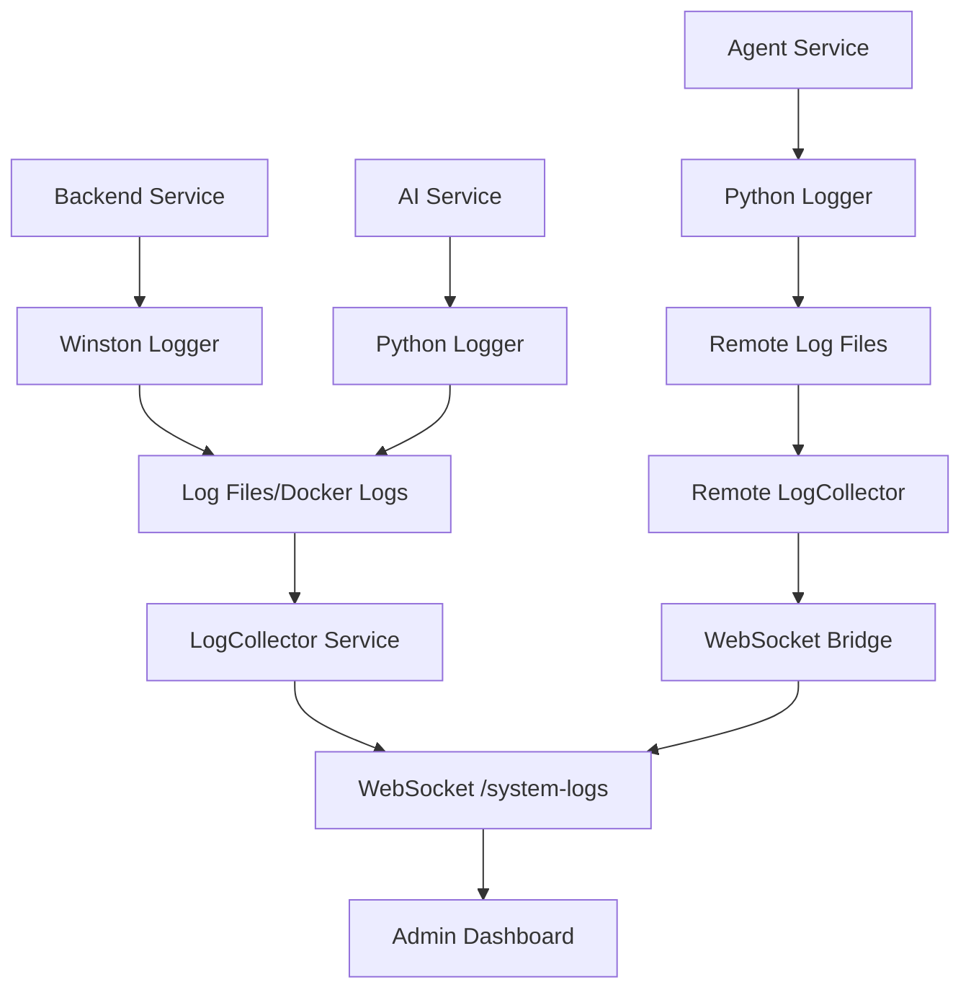

# DeployIO Logging Architecture Design

## 🎯 **Overview**

This document outlines the comprehensive logging architecture for the DeployIO platform, designed to handle system logs, user deployment logs, and real-time streaming across multiple environments and services.

## 🏗️ **Architecture Principles**

### 1. **Namespace-Based Organization**

```
WebSocket Namespaces:
├── /system-logs (Admin-only system logs)
├── /metrics (Admin-only system metrics)
├── /user-logs (User deployment logs)
└── /admin-logs (Combined admin view)
```

### 2. **Room-Based Segregation**

```
User Logs Namespace Rooms:
├── user:{userId} (User-specific logs)
├── project:{projectId} (Project-specific logs)
├── deployment:{deploymentId} (Deployment-specific logs)
└── admin:all (Admin view of all logs)
```

### 3. **Multi-Environment Support**

```
Log Sources:
├── Local Development (File reading)
├── Docker Production (docker-compose logs)
├── Remote Agent EC2 (WebSocket proxy)
└── User App Containers (Real-time streaming)
```

## 📊 **Data Flow Architecture**

### **System Logs Flow**



### **User Deployment Logs Flow**

```mermaid
graph TD
    A[User App Container] --> B[Container Stdout/Stderr]
    C[Build Process] --> D[Build Logs]
    E[Deployment Process] --> F[Deployment Logs]

    B --> G[Agent Log Collector]
    D --> G
    F --> G

    G --> H[WebSocket /user-logs]
    H --> I[Room: project:{id}]
    I --> J[User Dashboard]

    H --> K[Room: admin:all]
    K --> L[Admin Dashboard]
```

## 🔧 **Implementation Strategy**

### **Phase 1: Core Infrastructure**

1. **Unified Log Collector Service**
2. **Enhanced WebSocket Namespaces**
3. **Room Management System**
4. **Log Aggregation Service**

### **Phase 2: Remote Integration**

1. **Agent WebSocket Bridge**
2. **Real-time Log Streaming**
3. **Cross-Service Communication**

### **Phase 3: User Features**

1. **User Dashboard Integration**
2. **Project-specific Log Views**
3. **Real-time Deployment Logs**

### **Phase 4: Advanced Features**

1. **Log Search & Filtering**
2. **Log Retention Policies**
3. **Metrics Integration**
4. **Alerting System**

## 🛠️ **Technical Components**

### **1. Log Collector Service**

```javascript
class LogCollectorService {
  // Unified log collection from multiple sources
  // File-based, Docker-based, Remote-based
  // Real-time streaming capabilities
  // Log parsing and standardization
}
```

### **2. WebSocket Namespace Manager**

```javascript
class LogNamespaceManager {
  // /system-logs - Admin system logs
  // /user-logs - User deployment logs
  // /metrics - System metrics
  // Room management and authentication
}
```

### **3. Remote Log Bridge**

```javascript
class RemoteLogBridge {
  // WebSocket connection to remote Agent
  // Real-time log streaming from EC2
  // Failover to HTTP polling
  // Connection management
}
```

### **4. Log Storage & Retrieval**

```javascript
class LogStorageService {
  // Temporary log storage for active sessions
  // Log rotation and cleanup
  // Search and filtering capabilities
  // Export functionality
}
```

## 🌐 **Environment-Specific Strategies**

### **Local Development**

- **File-based log reading** using tail/fs.watch
- **Direct container access** for Docker Compose
- **Local WebSocket namespaces**

### **Production (Main Platform)**

- **Docker Compose logs** via CLI
- **Container log streaming** via Docker API
- **Centralized log aggregation**

### **Remote Agent (EC2)**

- **WebSocket bridge** to main platform
- **Local log collection** on agent
- **Real-time streaming** of user deployments
- **Independent operation** with sync capabilities

## 📋 **API Endpoints Structure**

### **Consolidated Log API**

```
/api/v1/logs/
├── system/
│   ├── backend           # Backend service logs
│   ├── ai-service        # AI service logs
│   └── agent             # Agent service logs (remote)
├── deployments/
│   ├── {deploymentId}    # Specific deployment logs
│   └── {projectId}       # Project-level logs
└── admin/
    ├── all               # Combined view
    └── metrics           # System metrics
```

### **WebSocket Endpoints**

```
/system-logs              # Admin-only system logs
/user-logs               # User deployment logs
/metrics                 # Real-time metrics
/admin-logs              # Combined admin view
```

## 🔐 **Security & Access Control**

### **Authentication Layers**

1. **Admin Access**: Full system logs and metrics
2. **User Access**: Own project/deployment logs only
3. **Service Access**: Internal service-to-service communication

### **Room Authorization**

```javascript
// User can only join their own rooms
const userRooms = [
  `user:${userId}`,
  `project:${userProjectIds}`,
  `deployment:${userDeploymentIds}`,
];

// Admin can join any room
const adminRooms = ["admin:all", "system:*", "user:*"];
```

## 📊 **Metrics Integration**

### **System Metrics Namespace**

- **Real-time system health**
- **Service uptime and performance**
- **Resource utilization**
- **Error rates and trends**

### **User Metrics**

- **Deployment success rates**
- **Build times and performance**
- **Resource usage per project**
- **User activity metrics**

## 🚀 **Future Considerations**

### **Scalability**

- **Log streaming buffering** for high traffic
- **Horizontal scaling** of log collectors
- **Database integration** for long-term storage

### **Advanced Features**

- **Log search and indexing**
- **Custom alerts and notifications**
- **Log analytics and insights**
- **Integration with monitoring tools**

### **Multi-Region Support**

- **Cross-region log aggregation**
- **Distributed logging infrastructure**
- **Global log search capabilities**

## 📝 **Implementation Priority**

### **Immediate (Week 1-2)**

1. ✅ Consolidate existing log routes
2. ✅ Implement unified log collector
3. ✅ Create enhanced WebSocket namespaces
4. ✅ Basic room management

### **Short-term (Week 3-4)**

1. 🔄 Remote agent integration
2. 🔄 User dashboard integration
3. 🔄 Real-time deployment logs
4. 🔄 Basic metrics integration

### **Medium-term (Month 2)**

1. 📋 Advanced filtering and search
2. 📋 Log retention policies
3. 📋 Performance optimization
4. 📋 Monitoring integration

### **Long-term (Month 3+)**

1. 🎯 Advanced analytics
2. 🎯 Multi-region support
3. 🎯 Custom alerting system
4. 🎯 Third-party integrations

---

**Next Steps**: Implement the core infrastructure starting with the unified log collector service and enhanced WebSocket namespaces.
