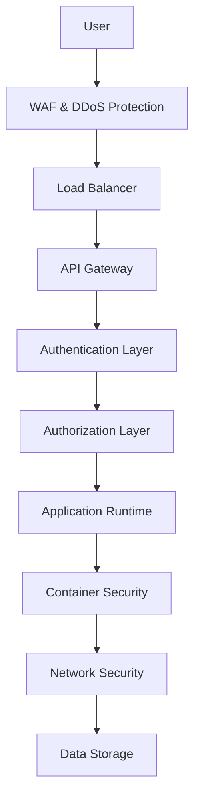

# Security Overview

Comprehensive overview of Deployio's enterprise-grade security features, designed to protect your applications, data, and infrastructure throughout the entire deployment lifecycle.

## Security-First Architecture

### Zero Trust Model

Deployio implements a zero-trust security architecture where every request is authenticated, authorized, and encrypted:

```yaml
security:
  zeroTrust:
    principles:
      - never-trust-always-verify
      - least-privilege-access
      - assume-breach-mentality
      - continuous-monitoring

    implementation:
      authentication: multi-factor
      authorization: role-based
      encryption: end-to-end
      monitoring: real-time
```

### Defense in Depth

Multiple layers of security controls:



## Identity and Access Management

### Multi-Factor Authentication (MFA)

Enhanced security with multiple authentication factors:

```yaml
authentication:
  mfa:
    required: true
    methods:
      - sms
      - email
      - authenticator-app
      - hardware-token
      - biometric

    policies:
      grace-period: 24h
      backup-codes: 10
      remember-device: 30d
```

### Single Sign-On (SSO)

Enterprise SSO integration:

```yaml
sso:
  providers:
    - okta
    - azure-ad
    - google-workspace
    - auth0
    - ping-identity

  protocols:
    - saml-2.0
    - openid-connect
    - oauth-2.0

  configuration:
    auto-provisioning: enabled
    group-mapping: automatic
    session-timeout: 8h
```

### Role-Based Access Control (RBAC)

Granular permission management:

```yaml
rbac:
  roles:
    viewer:
      permissions:
        - projects:read
        - deployments:read
        - logs:read

    developer:
      permissions:
        - projects:read
        - deployments:create
        - deployments:read
        - environments:manage

    admin:
      permissions:
        - "*"

  policies:
    inheritance: hierarchical
    assignment: group-based
    review: quarterly
```

## Data Protection

### Encryption Standards

Comprehensive encryption at all levels:

```yaml
encryption:
  at-rest:
    algorithm: AES-256-GCM
    key-management: customer-managed
    providers:
      - aws-kms
      - azure-key-vault
      - gcp-kms
      - hashicorp-vault

  in-transit:
    protocol: TLS-1.3
    cipher-suites:
      - TLS_AES_256_GCM_SHA384
      - TLS_CHACHA20_POLY1305_SHA256
    certificate-pinning: enabled

  in-processing:
    secure-enclaves: supported
    confidential-computing: available
```

### Data Classification

Automated data classification and protection:

```yaml
dataClassification:
  levels:
    public:
      encryption: standard
      access: unrestricted

    internal:
      encryption: enhanced
      access: authenticated-users

    confidential:
      encryption: advanced
      access: authorized-roles

    restricted:
      encryption: maximum
      access: explicit-approval

  automation:
    content-scanning: enabled
    machine-learning: active
    policy-enforcement: automatic
```

### Privacy Controls

GDPR and privacy compliance:

```yaml
privacy:
  gdpr:
    data-portability: automated
    right-to-erasure: implemented
    consent-management: integrated
    breach-notification: automated

  controls:
    data-minimization: enforced
    purpose-limitation: implemented
    storage-limitation: automated
    anonymization: available
```

## Infrastructure Security

### Container Security

Comprehensive container protection:

```yaml
containerSecurity:
  image-scanning:
    vulnerability-detection: enabled
    malware-scanning: active
    policy-enforcement: strict

  runtime-protection:
    behavioral-monitoring: enabled
    anomaly-detection: active
    threat-prevention: automatic

  compliance:
    cis-benchmarks: enforced
    nist-guidelines: implemented
    industry-standards: maintained
```

### Network Security

Advanced network protection:

```yaml
networkSecurity:
  segmentation:
    micro-segmentation: enabled
    zero-trust-networking: implemented

  firewalls:
    web-application-firewall: active
    network-firewall: configured
    host-based-firewall: enabled

  monitoring:
    traffic-analysis: real-time
    intrusion-detection: active
    anomaly-detection: machine-learning

  protection:
    ddos-mitigation: multi-layer
    bot-protection: ai-powered
    geo-blocking: configurable
```

### Infrastructure Hardening

Security hardening at all levels:

```yaml
hardening:
  operating-system:
    minimal-installation: standard
    security-patches: automatic
    configuration-management: automated

  kubernetes:
    pod-security-standards: enforced
    network-policies: strict
    admission-controllers: active

  cloud:
    security-groups: least-privilege
    iam-policies: minimal-access
    audit-logging: comprehensive
```

## Application Security

### Secure Development Lifecycle

Security integrated into development:

```yaml
sdlc:
  planning:
    threat-modeling: required
    security-requirements: defined

  development:
    secure-coding: standards
    static-analysis: automated
    dependency-scanning: continuous

  testing:
    dynamic-analysis: automated
    penetration-testing: regular
    security-testing: integrated

  deployment:
    security-validation: required
    configuration-scanning: automated
```

### Runtime Application Self-Protection (RASP)

Real-time application protection:

```yaml
rasp:
  protection:
    sql-injection: blocked
    xss-attacks: prevented
    command-injection: detected
    path-traversal: blocked

  monitoring:
    attack-detection: real-time
    threat-intelligence: integrated
    behavioral-analysis: continuous

  response:
    automatic-blocking: enabled
    alert-generation: immediate
    forensic-collection: automated
```

### API Security

Comprehensive API protection:

```yaml
apiSecurity:
  authentication:
    oauth-2.0: supported
    jwt-tokens: validated
    api-keys: managed

  authorization:
    scope-based: implemented
    rate-limiting: enforced
    quota-management: active

  protection:
    input-validation: strict
    output-encoding: automatic
    cors-policies: configured

  monitoring:
    traffic-analysis: real-time
    anomaly-detection: ai-powered
    threat-detection: continuous
```

## Compliance and Certifications

### Security Certifications

Industry-recognized security certifications:

```yaml
certifications:
  soc-2-type-ii:
    status: certified
    audit-frequency: annual
    scope: comprehensive

  iso-27001:
    status: certified
    recertification: tri-annual
    scope: global

  pci-dss:
    level: level-1
    validation: annual
    scope: payment-processing

  fedramp:
    authorization: moderate
    agency: dhs
    scope: government-cloud
```

### Compliance Frameworks

Automated compliance management:

```yaml
compliance:
  frameworks:
    hipaa:
      controls: implemented
      risk-assessment: annual
      training: mandatory

    gdpr:
      privacy-impact: assessed
      data-protection: implemented
      breach-procedures: documented

    sox:
      financial-controls: implemented
      audit-trail: comprehensive
      segregation-duties: enforced
```

## Threat Detection and Response

### Security Information and Event Management (SIEM)

Centralized security monitoring:

```yaml
siem:
  data-sources:
    - application-logs
    - infrastructure-logs
    - network-traffic
    - user-activities
    - security-events

  analysis:
    real-time-correlation: active
    machine-learning: deployed
    threat-intelligence: integrated

  alerting:
    severity-based: configured
    escalation-procedures: defined
    automated-response: enabled
```

### Incident Response

Structured incident response process:

```yaml
incidentResponse:
  phases:
    preparation:
      team-training: regular
      procedures: documented
      tools: prepared

    detection:
      monitoring: 24x7
      alerting: automated
      triage: immediate

    containment:
      isolation: automatic
      evidence-preservation: standard
      impact-assessment: rapid

    eradication:
      root-cause-analysis: thorough
      remediation: comprehensive
      validation: independent

    recovery:
      system-restoration: careful
      monitoring: enhanced
      lessons-learned: documented
```

### Threat Intelligence

Proactive threat awareness:

```yaml
threatIntelligence:
  sources:
    - commercial-feeds
    - open-source-intelligence
    - government-sources
    - industry-sharing

  integration:
    siem-correlation: automatic
    firewall-blocking: real-time
    alert-enrichment: contextual

  analysis:
    attribution: advanced
    campaign-tracking: comprehensive
    indicator-analysis: automated
```

## Security Monitoring

### Continuous Monitoring

24/7 security surveillance:

```yaml
monitoring:
  coverage:
    infrastructure: 100%
    applications: 100%
    network: 100%
    user-activities: 100%

  metrics:
    security-events: real-time
    vulnerability-status: continuous
    compliance-posture: ongoing

  dashboards:
    executive: strategic
    operational: tactical
    technical: detailed
```

### Vulnerability Management

Proactive vulnerability handling:

```yaml
vulnerabilityManagement:
  scanning:
    frequency: continuous
    coverage: comprehensive
    accuracy: high

  assessment:
    risk-scoring: cvss-v3
    business-impact: assessed
    exploitability: analyzed

  remediation:
    prioritization: risk-based
    timelines: sla-driven
    tracking: automated

  reporting:
    executive-summary: monthly
    technical-details: weekly
    trend-analysis: quarterly
```

## Security Operations Center (SOC)

### 24/7 Security Operations

Round-the-clock security monitoring:

```yaml
soc:
  staffing:
    tier-1: 24x7
    tier-2: 24x7
    tier-3: on-call

  capabilities:
    threat-hunting: proactive
    incident-response: immediate
    forensic-analysis: expert

  tools:
    siem: enterprise-grade
    soar: automated
    threat-intelligence: integrated

  metrics:
    mean-time-to-detection: < 5min
    mean-time-to-response: < 15min
    false-positive-rate: < 2%
```

### Security Automation

Automated security operations:

```yaml
automation:
  detection:
    rule-based: configured
    machine-learning: deployed
    behavioral-analysis: active

  response:
    containment: automatic
    investigation: assisted
    remediation: guided

  orchestration:
    workflow-automation: implemented
    tool-integration: seamless
    decision-support: ai-powered
```

## Privacy and Data Governance

### Data Governance Framework

Comprehensive data management:

```yaml
dataGovernance:
  policies:
    data-classification: mandatory
    retention-schedules: defined
    access-controls: enforced

  procedures:
    data-handling: standardized
    breach-response: documented
    audit-procedures: regular

  technology:
    data-loss-prevention: deployed
    rights-management: implemented
    audit-logging: comprehensive
```

### Privacy by Design

Privacy built into every system:

```yaml
privacyByDesign:
  principles:
    default-privacy: implemented
    privacy-embedded: standard
    full-functionality: maintained

  implementation:
    data-minimization: enforced
    consent-management: integrated
    anonymization: automated

  controls:
    purpose-limitation: implemented
    storage-limitation: enforced
    transparency: provided
```

## Security Training and Awareness

### Security Education

Comprehensive security training:

```yaml
training:
  mandatory:
    security-awareness: annual
    phishing-simulation: quarterly
    incident-response: bi-annual

  role-specific:
    developers: secure-coding
    administrators: hardening
    managers: risk-management

  certification:
    cissp: encouraged
    cism: supported
    sans: available
```

### Security Culture

Building security-conscious culture:

```yaml
culture:
  initiatives:
    security-champions: program
    bug-bounty: internal
    security-games: regular

  communication:
    security-newsletter: monthly
    threat-briefings: weekly
    lessons-learned: shared

  metrics:
    training-completion: tracked
    security-incidents: analyzed
    culture-surveys: conducted
```

## Audit and Compliance

### Regular Audits

Systematic security reviews:

```yaml
audits:
  internal:
    frequency: quarterly
    scope: comprehensive
    findings: tracked

  external:
    frequency: annual
    auditors: independent
    standards: industry

  penetration-testing:
    frequency: bi-annual
    scope: full-scope
    remediation: prioritized
```

### Compliance Reporting

Automated compliance documentation:

```yaml
reporting:
  compliance:
    dashboards: real-time
    reports: automated
    evidence: collected

  audit-trails:
    access-logs: comprehensive
    change-logs: detailed
    security-events: complete

  certifications:
    status-tracking: automated
    renewal-alerts: proactive
    evidence-collection: continuous
```

## Getting Started with Security

### Security Assessment

Begin with a comprehensive security evaluation:

```bash
# Run security assessment
deployio security assess --comprehensive

# Generate security report
deployio security report --format executive

# Review recommendations
deployio security recommendations --priority high
```

### Security Configuration

Apply security best practices:

```bash
# Enable security features
deployio security enable --all

# Configure compliance
deployio compliance configure --frameworks soc2,gdpr

# Set up monitoring
deployio security monitoring --enable-all
```

### Security Integration

Integrate security into your workflow:

```yaml
# .deployio/security.yml
security:
  policies:
    enforce: true
    block-on-critical: true

  scanning:
    code: enabled
    dependencies: enabled
    containers: enabled

  monitoring:
    runtime: enabled
    network: enabled
    access: enabled
```

## Next Steps

- [Explore encryption capabilities](./encryption.md)
- [Configure access control](./access-control.md)
- [Review compliance standards](./compliance.md)
- [Set up vulnerability management](./vulnerability-management.md)

Your security is our priority. Deploy with confidence! 🛡️
